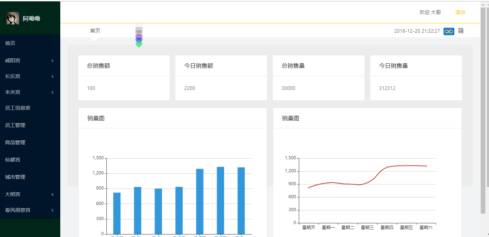
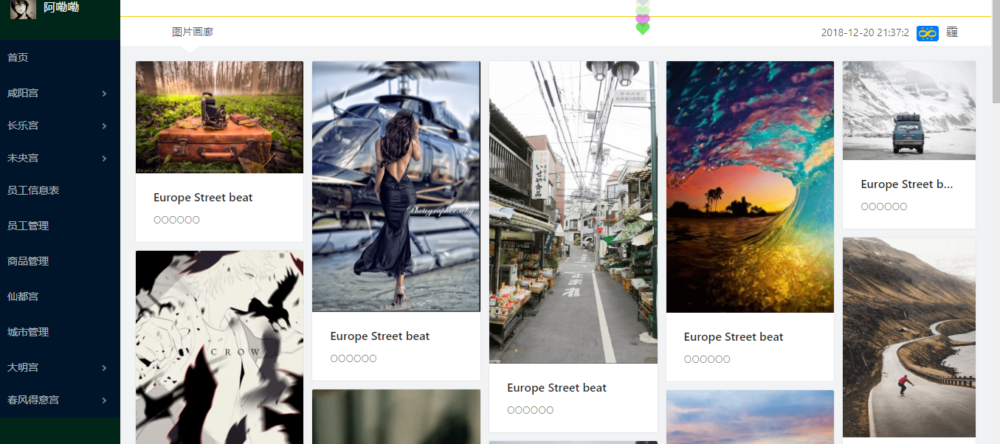
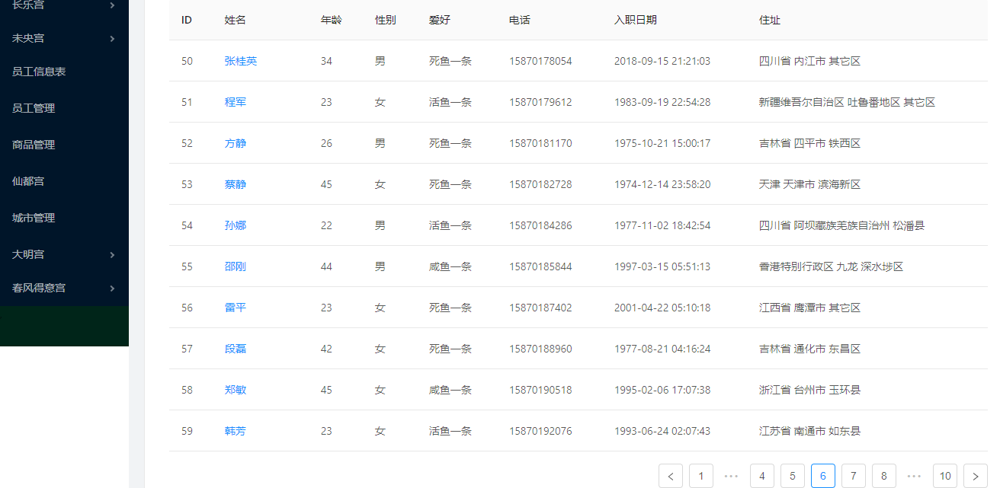
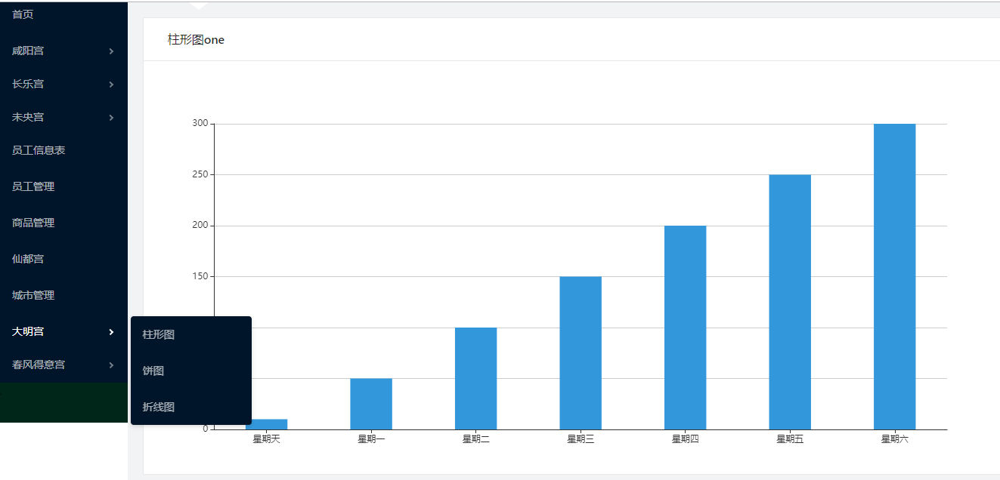
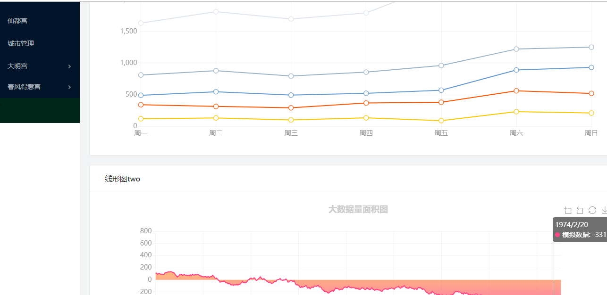
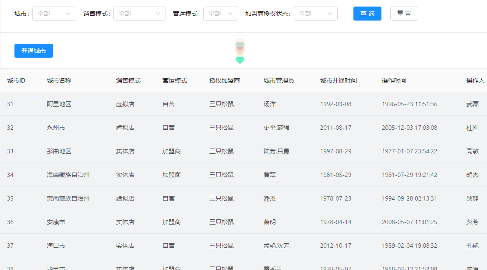

喜欢的话来点Star

##项目结构
├── src                     // React      
│ ├── App                   // 总体容器    
│ ├── axios                 // 封装请求数据 / promise 和jsonp    
│ ├── components            // 页面组件  header / footer / NavLeft    
│ │ ├── Footer              // 页面尾部    
│ │ ├── Header              // 页面头部    
│ │ ├── NavLeft             // 页面左部    
│ ├── config                // mork 数据----原来有， 目前已经更新为在线数据      
│ ├── modules               // 目前还没开发， 计算用node socket.io 写一个在线聊天室                                    
│ ├── pages                 // React 主体-------------------------------所有的页面都在    
│ ├──├── City              // 城市管理系统  
│ │  ├── Detail            // 目前尚未构建 计划写详情页面    
│ │  ├── echarts           // 图片区域 分为柱形图/园形图/线图  
│ │  ├── EmployeeInfo      // 员工信息表  
│ │  ├── EmployeeMan       // 计划写管理员工  -----增删改查  
│ │  ├── Gallery           // 用Card写的类似于瀑布流的效果图  
│ │  ├── Home              // 主页------------------------------------------------    
│ │  ├── Login             // 登录页面 ， 目前构思中------------------------------------------------   
│ │  ├── Nomatch           // 404 辅助页面 ， -----------------   
│ │  ├── redux             // 懒得解释看不懂就算了  
│ │  ├── ui                // 做做样子的    
│ ├── resource              // 公共图片区    
│ ├── style                 // 公共less样式区       
│ ├── te                    // 封装好的心心特效    
│ ├── untils                // 封装好的工具     
├── admin.jsx               // 页面的整体布局   
├── index.css               // 页面的主体样式     
├── index.js                // 系统的东西       
├── router.jsx              // 路由配置       
## 技术栈
1:react
2:react-router-dom
5:ant-design
6:axios
7:less
8: redux react-redux redux-devtools-extension
9: echarts
